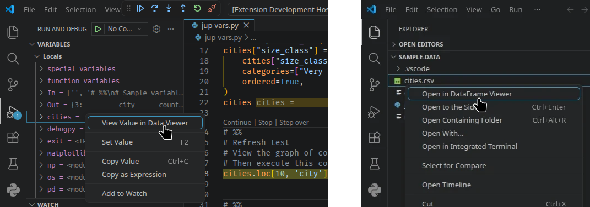

# DataFrame Viewer

View tabular Jupyter variables and data files.

## Main Features

- View data in a **tabular grid** with sticky index and column headers.
- **Sort** with multiple keys.
- Look at **missing value ratios** and the distribution **plots** (histogram or stacked bar).
- **Filter** using [Pandas' query syntax](https://pandas.pydata.org/docs/reference/api/pandas.DataFrame.query.html).
- **Quick filter** data by clicking in the plots.
- **Colorize** cells and graphs.

## Usage

### View Data

Load Jupyter variables, when executing a Jupyter notebook or a Python script with the interactive window. You need to grant kernel access once.

View variables in debug mode and open files. *Note: Data types are not inferred from CSV or TSV files.*

### Sort

Stable sort with multiple keys (last has priority).

### Stats

Missing value ratios and distribution plots.

### Filter

Filter data using [Pandas' query syntax](https://pandas.pydata.org/docs/reference/api/pandas.DataFrame.query.html). Add filter expressions by clicking into the plots. Multiple filters are appended with Operator `&`.

### Colorize

Colorize cells and histograms with columnwise or global vmin/vmax for numeric columns, optionally symmetrically centered around 0.

## Requirements

This extension requires:

- Python with
  - Pandas
  - NumPy
  - Matplotlib (for colorize feature)
  - PyArrow (for `*.parquet`, `*.feather` import)
- VS Code extensions
  - Python
  - Jupyter

## License

[MIT](LICENSE)
