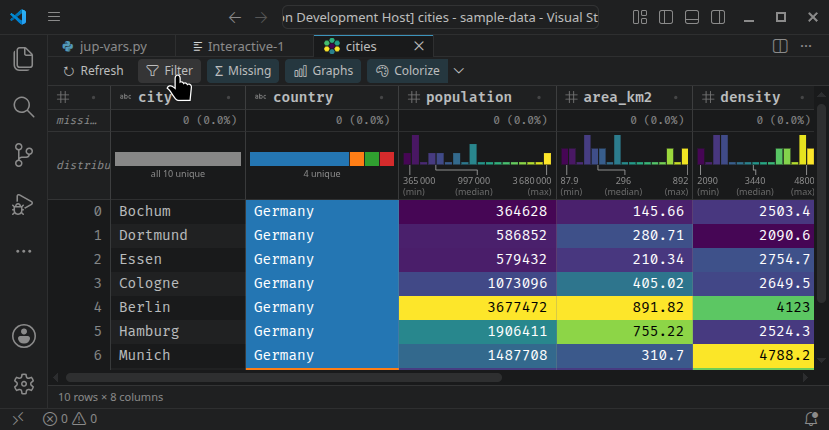
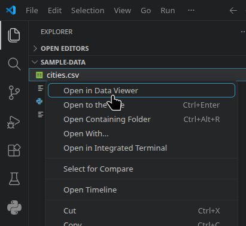
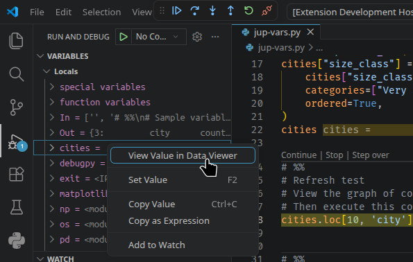
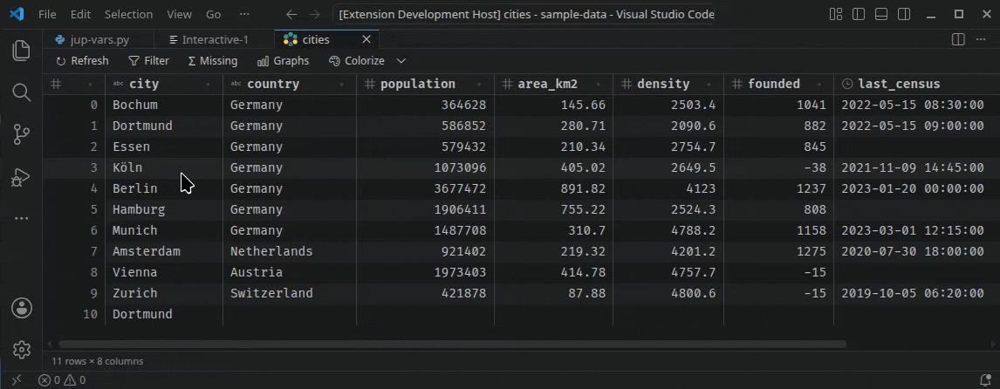
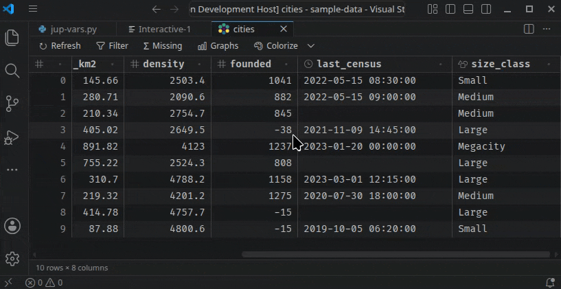

# Data Viewer

View tabular Jupyter variables and data files.



## Main Features

- View data in a **tabular grid** with sticky index and column headers.
- Show **dtype** and number of **missing values** per column.
- **Sort** with multiple keys.
- **Filter** using [Pandas' query syntax](https://pandas.pydata.org/docs/reference/api/pandas.DataFrame.query.html).
- Draw distribution **graphs** for each column, depending on data type:
  - Numeric column → Histogram
  - DateTime or TimeDelta column → Histogram
  - Ordered Categorical column → Bar Plot
  - String or Boolean column → Stacked Bar Plot
- **Quick filter** data from the distribution graphs.
- **Colorize** cells and graphs using a colormap with many settings.

## Usage

### View Data

Load Jupyter variables, when executing a Jupyter notebook or a Python script with the interactive window. You need to grant kernel access once. You can see the dtypes, enable the missing data count and refresh the table.


Open files. *Note: Data types are not inferred from CSV or TSV files.* | View variables in debug mode.
---------------------------------------------------------------------- | -----------------------------
 | 

### Filter

Filter data using pandas query syntax.



### Sort

Stable sort with multiple keys (last has priority).



### Graphs, Quick Filter, Colorize

## Development

```bash
npm install
npm run build     # bundle extension + webview with esbuild
npm run watch     # rebuild on change
npm run typecheck # tsc --noEmit
npm test          # unit tests (node:test via tsx)
```

Unit tests live in `test/` and cover the pure logic: the pandas data path
(`pandasTable.ts` — index handling, cell formatting, truncation, output
parsing, generated Python), the webview column helpers (`columns.ts` — numeric
detection, widths, index/sticky cell classes), the load/refresh message loop
(`tableHost.ts` — init sampling, chunk slicing, refresh, error handling, and the
busy guard against overlapping reloads), Colorize text-contrast helper
(`contrast.ts`), and a specificity guard for the row-hover CSS fix.

Press **F5** in VS Code to launch an Extension Development Host with the
extension loaded, then open `sample-data/cities.csv` with it.

See [CONTRIBUTING.md](CONTRIBUTING.md) for the non-obvious internals — the
pandas-engine model, the generated-Python rules, Colorize reload model, and
the test/verification workflow.

## Architecture

- `src/extension.ts` — activation, `dataViewer.open` command
- `src/pandasTable.ts` — the shared pandas path: Python code that serializes a
  DataFrame-like object as JSON, and the TypeScript that turns the payload
  into table columns/rows
- `src/jupyterVariableViewer.ts` — registered via the `jupyterVariableViewers`
  contribution point; runs the dump code in the notebook's kernel via the
  Jupyter extension's kernel API (`@vscode/jupyter-extension`)
- `src/tableEditorProvider.ts` — `CustomReadonlyEditorProvider`; runs the same
  dump code with `pd.read_csv` in a Python subprocess
- `src/pythonRunner.ts` — resolves the interpreter (Python extension API,
  fallback `python3`) and runs scripts
- `src/colorizeSettings.ts` — reads/writes the persisted Colorize on/off and
  colormap in the extension's global state
- `src/tableWebview.ts` — wires a real webview to the table host (HTML, CSP,
  `postMessage`, error notifications)
- `src/tableHost.ts` — the webview message loop (load/refresh/serve chunks),
  kept vscode-free so it can be unit-tested
- `src/webview/main.ts` — virtualized table; requests only the visible row
  chunks and caches a bounded number of them
- `src/webview/columns.ts` — pure column helpers (numeric detection, widths,
  cell classes), kept DOM-free so they can be unit-tested
- `src/webview/contrast.ts` — pure helper picking black/white text for a
  colored cell background
- `src/webview/dtypes.ts` — maps a column's dtype kind to its header glyph
- `src/shared/protocol.ts` — typed messages between host and webview

Row storage stays in the extension host (instead of shipping everything into
the webview), and pandas being the single engine means later features like
sorting, filtering, and column statistics can be pandas operations with
identical behavior for files and variables.
